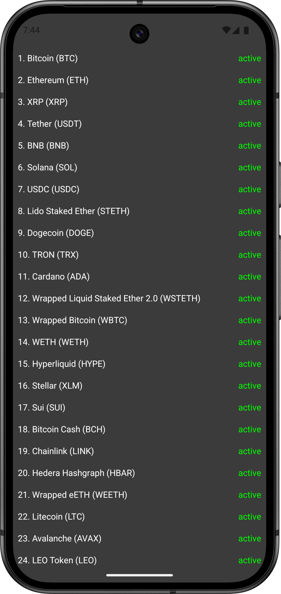

# CryptoAppSample

## 📸 Screenshots

  
  

## 📄 Project Overview

This project is a simple crypto listing app developed to practice Clean Architecture principles. It
focuses on use-case-driven structure, proper UI state management across configuration changes, and
establishing a modular, scalable codebase for modern Android development.

## 📌 Tech Stack

- **Clean Architecture** – Layered design for separation of concerns and testability
- **Navigation Component** – Modern navigation handling with a single-activity architecture
- **Retrofit** – For fetching coin data via REST API
- **ViewModel & StateFlow** – Reactive UI state management
- **Hilt** – Dependency injection for decoupled, modular components
- **ViewBinding** – Type-safe access to views without boilerplate
- **Coroutines & Flow** – Asynchronous and reactive data handling